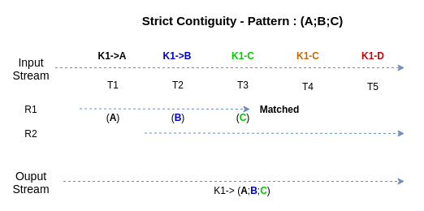
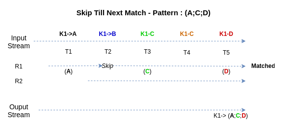
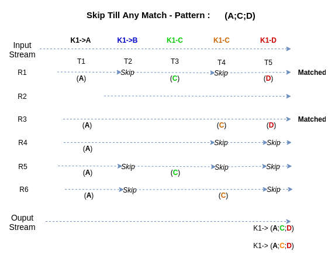

Complex Event Processing on top of Kafka Streams Processor API !
=============================================================


[Apache Kafka](http://kafka.apache.org/) is a high-throughput, distributed, publish-subscribe messaging system.

This library can be used to extend the [Kafka Streams API](http://kafka.apache.org/documentation.html#streams) in order to select complex event sequences from streams.

It provides a convenient DSL to build complex event queries. 

This library is still evolving and public APIs may change in future.

## Quick Start

Add the KafkaStreamsCEP to the dependency of the pom.xml of your project. 
Note that the last version is currently not available in Maven Central yet.

### Maven dependency

For Apache Kafka 0.10.0.1 (deprecated)

Available in [Maven Central](https://search.maven.org/#artifactdetails%7Ccom.github.fhuss%7Ckafka-streams-cep%7C0.1.0%7Cjar)

```xml
    <dependency>
      <groupId>com.github.fhuss</groupId>
      <artifactId>kafka-streams-cep</artifactId>
      <version>0.1.0</version>
    </dependency>
```

As of Apache Kafka 1.0.0

```xml
    <dependency>
      <groupId>com.github.fhuss</groupId>
      <artifactId>kafka-streams-cep</artifactId>
      <version>0.2.0-SNAPSHOT</version>
    </dependency>
```

### Define a pattern

```java
        ...
        
        Properties streamsConfiguration = new Properties();
        streamsConfiguration.put(StreamsConfig.APPLICATION_ID_CONFIG, "my-first-cep-app");
        streamsConfiguration.put(StreamsConfig.BOOTSTRAP_SERVERS_CONFIG, "localhost:9092");
        streamsConfiguration.put(StreamsConfig.DEFAULT_KEY_SERDE_CLASS_CONFIG, Serdes.StringSerde.class);
        streamsConfiguration.put(StreamsConfig.DEFAULT_VALUE_SERDE_CLASS_CONFIG, Serdes.StringSerde.class);

        Pattern<String, String> pattern = new QueryBuilder<String, String>()
                .select("select-A")
                    .where((event, store) -> event.value().equals("A"))
                    .then()
                .select("select-B")
                    .where(((event, store) -> event.value().equals("B")))
                    .then()
                .select("select-C")
                    .where(((event, store) -> event.value().equals("C")))
                .build();

        StreamsBuilder builder = new StreamsBuilder();

        KStream<String, String> letters = builder.stream("Letters");

        KStream<String, Sequence<String, String>> sequences = new ComplexStreamsBuilder().stream(letters)
                .query("MyLettersQuery", pattern);
        
        sequences.print(Printed.toSysOut());

        KafkaStreams kafkaStreams = new KafkaStreams(builder.build(), streamsConfiguration);
        kafkaStreams.start();
        
        ...

```

## The Pattern API

The Kafka Streams CEP library defines a Pattern API that allow you to define complex event pattern sequence that will be used to select records from input streams.

A complex pattern sequence is made of multiple **stages**. Each stage consists of a single **pattern** or a multiple patterns combined together with a logical AND or OR operator.

These simple patterns specify the conditions necessary to select an event from the input streams and to go to the next following stage.

To create a new complex pattern sequence you have to first create a new pattern `QueryBuilder` instance.
A pattern query defines a sequence of events that occur in order but not necessarily in contiguous positions in the input stream.
```java
QueryBuilder<String, Integer> builder = new QueryBuilder<>();
```

<table>
    <thead>
    <tr>
        <th>Pattern Builder Methods </th>
        <th>Description & Examples</th>
    </tr>
    </thead>
    <tbody>
    <tr>
        <td><pre lang="java">select()</pre></td>
        <td>
            <p>Defines a new simple pattern.</p>
            <pre lang="java">select = query.select();</pre>
            <p>Stage can be named</p>
            <pre lang="java">select = query.select("my-first-stage");</pre>
        </td>
    </tr>
    <tr>
        <td><pre lang="java">optional()</pre></td>
        <td>
            <p>Defines that this pattern is optional. i.e. that at most one event can match this pattern.</p>
            <pre lang="java">builder.optional()</pre>
        </td>
    </tr>
    <tr>
        <td><pre lang="java">zeroOrMore()</pre></td>
        <td>
            <p>Defines that zero or multiple events can match this pattern.</p>
            <pre lang="java">builder.zeroOrMore()</pre>
        </td>
    </tr>
    <tr>
        <td><pre lang="java">oneOrMore()</pre></td>
        <td>
            <p>Defines that at least one event should match this pattern.</p>
            <pre lang="java">builder.oneOrMore()</pre>
        </td>
    </tr>
    <tr>
        <td><pre lang="java">where(Matcher)</pre></td>
        <td>
<p>Defines the condition under which an event should be selected to be added to the pattern sequence.</p>
<p>Currently, three types of Matcher can be used to select a relevant event.</p> 
<strong>SimpleMatcher</strong>        
<pre lang="java">
builder.where(new SimpleMatcher<String, String>() {
    @Override
    public boolean matches(Event<String, String> event) {
           return event.value().equals("A");
    }
});
</pre>
<strong>StatefulMatcher</strong>        
<pre lang="java">
builder.where(new StatefulMatcher<String, Integer>() {
   @Override
   public boolean matches(Event<String, Integer> event, States states) {
       double average = (int)states.get("sum") / (int)states.get("count");
       return average >= event.value();
   }
});
</pre>
<strong>SequenceMatcher</strong>        
<pre lang="java">
builder.where(new SequenceMatcher<String, Integer>() {
    @Override
    public boolean matches(Event<String, Integer> event, Sequence<String, Integer> sequence, States states) {
        double average = StreamSupport.stream(sequence.spliterator(), false)
                .mapToInt(Event::value)
                .summaryStatistics()
                .getAverage();
        return average >= event.value(); }
    }) 
});
</pre>
        </td>
    </tr>
    <tr>
        <td><pre lang="java">fold(state, aggregator)</pre></td>
        <td>
<p>
The fold() method allows to accumulate some state between each pattern. Then the defined states can be used latter to select relevant events. <br/>The aggregator function is invoke only if the input
</p>        
<pre lang="java">
builder.fold("amount", new Aggregator<String, Integer, Integer>() {
    @Override
    public Integer aggregate(String key, Integer value, Integer accumulated) {
        return accumulated + value;
    }
});
</pre>
        </td>
    </tr>
    <tr>
        <td><pre lang="java">and(Matcher)</pre></td>
        <td>
        <p>Combines two simple patterns in a stage with a logical operator AND.</p>
<pre lang="java">
builder.where( (event) -> event.value() > 0).and((event) -> event.value() < 10)    
</pre>
        </td>
    </tr>
    </tr>
    <tr>
        <td><pre lang="java">or(Matcher)</pre></td>
        <td>
        <p>Combines two simple patterns in a stage with a logical operator OR.</p>
<pre lang="java">
builder.where( (event) -> event.value().equals("A")).or((event) -> event.value().equals("B")))    
</pre>
        </td>
    </tr>
    <tr>
        <td>within(time, TimeUnit)</td>
        <td>
        <p>Defines a time window over the entire complex pattern.</p>
<pre lang="java">
builder.within(1, TimeUnit.HOUR)
});
</pre>
        </td>
    </tr>
    </tbody>
</table>

## Event Selection Strategies

Currently, this library supports the following event selection strategies :  

 * `Strict contiguity` :  Selected events must be contiguous in the input stream. By default, this is selection strategy used to match complexes sequences.
 
 <p align="center">
 
 </p>
 
This strategy can be chosen while defining a new stage :
```java
builder.select("my-stage", Selected.withStrictContiguity())
```   

 * `Skip till next match` :Irrelevant events are skipped until an event matching the next pattern is encountered. If multiple events in the stream can match the next pattern only the first of them is selected.

 <p align="center">
 
 </p>
 
This strategy can be chosen while defining a new stage :
 
 ```java
 builder.select("my-stage", Selected.withSkipTilNextMatch())
 ```   
 
 * `Skip till any match` : Irrelevant events are skipped until an event matching the next pattern is encountered. All events in the stream that can match a pattern are selected.
 
 <p align="center">
 
 </p>
 
 This strategy can be chosen while defining a new stage :
 ```java
 builder.select("my-stage", Selected.withSkipTilAnyMatch())
 ```   
 
## How to match an event from a specific topic ?

The KafkaStreams allow you to consume from multiple input topics.

While defining a new stage you can specify the topic name on which the pattern should be applied : 
 ```java
 builder.select("my-stage", Selected.fromTopic("my-topic")))
 ```  

## Demonstration

The below example is based on the research paper **Efficient Pattern Matching over Event Streams**.

Implementation based on https://people.cs.umass.edu/~yanlei/publications/sase-sigmod08.pdf

### CEP Query :

```
     PATTERN SEQ(Stock+ a[ ], Stock b)
       WHERE skip_till_next_match(a[ ], b) {
           [symbol]
       and
           a[1].volume > 1000
       and
           a[i].price > avg(a[..i-1].price)
       and
           b.volume < 80%*a[a.LEN].volume }
       WITHIN 1 hour
```

### Build Query
```java
            .select("stage-1")
                .where((event, states) -> event.value().volume > 1000)
                .<Long>fold("avg", (k, v, curr) -> v.price)
                .then()
            .select("stage-2", Selected.withSkipTilNextMatch())
                .zeroOrMore()
                .where((event, states) -> event.value().price > (long) states.get("avg"))
                .<Long>fold("avg", (k, v, curr) -> (curr + v.price) / 2)
                .<Long>fold("volume", (k, v, curr) -> v.volume)
                .then()
            .select("stage-3", Selected.withSkipTilNextMatch())
                .where((event, states) -> event.value().volume < 0.8 * (long) states.getOrElse("volume", 0L))
            .within(1, TimeUnit.HOURS)
            .build();
```

### KStreams API:
```java
        Pattern<Object, StockEvent> pattern = ...

        ComplexStreamsBuilder builder = new ComplexStreamsBuilder();

        CEPStream<String, StockEvent> stream = builder.stream("StockEvents");
        KStream<String, Sequence<String, StockEvent>> stocks = stream.query("Stocks", pattern, Queried.with(Serdes.String(), new StockEventSerde()));
        
        KafkaStreams streams = new KafkaStreams(builder.build(), props);
```

### Processor API:
```java
        Pattern<Object, StockEvent> pattern = ...

        final String queryName = "Stocks";

        Topology topology = new Topology()
                .addSource("source", "StockEvents")
                .addProcessor("cep-processor", () -> new CEPProcessor<>(queryName, pattern), "source")
                .addSink("sink", "Matches", "cep-processor");

        // utility class to register all stores associated with the pattern.
        CEPStoreBuilders<String, StockEvent> builders = new CEPStoreBuilders<>();
        builders.addStateStores(topology, "cep-processor", queryName, pattern, Serdes.String(), new StockEventSerde());
        
        CEPStoreBuilders<K, V> storeBuilders = new CEPStoreBuilders<>(queryName, pattern);
        topology.addStateStore(storeBuilders.getEventBufferStoreBuilder(keySerde, valueSerde), "cep-processor");
        topology.addStateStore(storeBuilders.getNFAStateStoreBuilder(keySerde, valueSerde), "cep-processor");
        topology.addStateStore(storeBuilders.getAggregateStateStores(), "cep-processor");
        
        KafkaStreams streams = new KafkaStreams(topology, props);
```

## States

To track the states of matched sequences, KafkaStreamsCEP needs to create three persistent stores for each query.
This state stores will result in the creationf of the following changelog topics :  

- <application_id>-<query_name>-streamscep-aggregates-changelog
- <application_id>-<query_name>-streamscep-matched-changelog
- <application_id>-<query_name>-streamscep-states-changelog


## Demo

Run the demonstration class **CEPStockDemo** :

- Create Input/Ouput streams topics
```bash
/bin/kafka-topics --create --topic Stocks --partitions 2 --replication-factor 1 --zookeeper localhost:2181
Created topic "Stocks".

/bin/kafka-topics --create --topic Matches --partitions 2 --replication-factor 1 --zookeeper localhost:2181
Created topic "Matches".
```
- Produce the following json events **StockEvents**:
```bash
./bin/kafka-console-producer --topic Stocks  --property parse.key=true --property key.separator=, --broker-list localhost:9092
```

- Input

```json
key1,{"name":"e1","price":100,"volume":1010}
key1,{"name":"e2","price":120,"volume":990}
key1,{"name":"e3","price":120,"volume":1005}
key1,{"name":"e4","price":121,"volume":999}
key1,{"name":"e5","price":120,"volume":999}
key1,{"name":"e6","price":125,"volume":750}
key1,{"name":"e7","price":120,"volume":950}
key1,{"name":"e8","price":120,"volume":700}
```

- Consume from the sink topic **"Matches"**

```bash
./bin/kafka-console-consumer --new-consumer --topic Matches --bootstrap-server localhost:9092
```
- Output

```json
{"events":[{"name":"stage-1","events":["e1"]},{"name":"stage-2","events":["e2","e3","e4","e5"]},{"name":"stage-3","events":["e6"]}]}
{"events":[{"name":"stage-1","events":["e3"]},{"name":"stage-2","events":["e4"]},{"name":"stage-3","events":["e6"]}]}
{"events":[{"name":"stage-1","events":["e1"]},{"name":"stage-2","events":["e2","e3","e4","e5","e6","e7"]},{"name":"stage-3","events":["e8"]}]}
{"events":[{"name":"stage-1","events":["e3"]},{"name":"stage-2","events":["e4","e6"]},{"name":"stage-3","events":["e8"]}]}
```

## TODO
 * Improve test scenarios

## Contributions
Any contribution is welcome

## Licence
Licensed to the Apache Software Foundation (ASF) under one or more contributor license agreements. See the NOTICE file distributed with this work for additional information regarding copyright ownership. The ASF licenses this file to you under the Apache License, Version 2.0 (the "License"); you may not use this file except in compliance with the License. You may obtain a copy of the License at

http://www.apache.org/licenses/LICENSE-2.0

Unless required by applicable law or agreed to in writing, software distributed under the License is distributed on an "AS IS" BASIS, WITHOUT WARRANTIES OR CONDITIONS OF ANY KIND, either express or implied. See the License for the specific language governing permissions and limitations under the License
